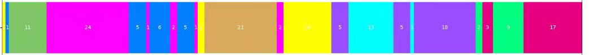

# Slowfast视频切分

[官方仓库](https://github.com/facebookresearch/SlowFast)

## 训练

官方仓库中有各种类型的网络可以选择，我一直使用的都是`SLOWFAST_4x16_R50`，对应的配置文件为`configs/Kinetics/c2/SLOWFAST_4x16_R50_train.yaml`

训练环境：在202有一个直接可以用的conda环境：

```
conda activate slowfast
```

训练命令：

```
python tools/run_net.py --cfg configs/Kinetics/c2/SLOWFAST_4x16_R50_train.yaml
```

配置文件重要参数说明：

- `OUTPUT_DIR`：训练结果的保存路径
- `TRAIN.CHECKPOINT_FILE_PATH`：指定的是预训练模型的路径，但是如果`OUTPUT_DIR`下有checkpoints文件夹，则会加载checkpoints文件夹里最新的模型继续训练
- `TENSORBOARD.ENABLE`：是否开启`tensorboard`
- `SOLVER.MAX_EPOCH`：最大epoch
- `MODEL.NUM_CLASSES`：动作类别数量

一般整理了一批新的数据后，只需要修改`OUTPUT_DIR`就可以训练，其它的参数可以去看官方仓库或者源码。

## 测试

#### 测试指标

测试功能是我自己定义的，官方仓库的test功能是基于视频的，也就是一个视频预测一个标签，描述如下：

```
Perform mutli-view testing that uniformly samples N clips from a video along
its temporal axis. For each clip, it takes 3 crops to cover the spatial
dimension, followed by averaging the softmax scores across all Nx3 views to
form a video-level prediction. All video predictions are compared to
ground-truth labels and the final testing performance is logged.
```

我们训练的模型在这个test指标下`top1_acc`能达到98%，但是这个指标是不符合我们的应用场景的，由于需要拿来做切分的依据，所以我们要统计对视频的每一个clip的预测正确率，一个clip由64帧组成，一个31秒的视频，帧率30，就是930帧，则有15个clip，模型会对这15个clip都输出一个结果，我们统计这些结果的准确率。

实现方法是在`demo_net.py`里增加了一个`my_test`函数，修改了`run_net.py`，`DEMO.ENABLE==True`时不再调用`demo`函数而调用`my_test`，`my_test`会读取`data/test.csv`，预测里面每一个视频，并记录对所有clip判断结果的正确性，最后打印总准确率，并将结果写入`res.csv`（在代码里指定）。

`res.csv`格式如下:

```
正确的clip数 错误的clip数 视频地址 标签
9 0 data/200_50/pd2/22/xiangxia_0_video.avi 7
1 0 data/200_50/pd1/01/tadi_0_video.avi 4
20 0 data/200_50/pd3/41/pose_0_video.avi 3
10 1 data/200_50/pd1/40/woquan_0_video.avi 6
6 0 data/200_50/pd1/14/woquan_0_video.avi 6
21 8 data/200_50/pd3/52/duizhi_0_video.avi 2
```

使用`data_process/cal_action_acc.py`，输入`res.csv`可以统计对每个动作的预测准确率，输出如：

```
diandi 0.9461538461538461
down 0.9809523809523809
duizhi 0.9186046511627907
pose 1.0
tadi 0.9135135135135135
up 1.0
woquan 0.8659217877094972
xiangxia 1.0
zhengfan 0.9791666666666666
```

#### 测试方法

使用的配置文件为`configs/Kinetics/c2/SLOWFAST_4x16_R50.yaml`

测试命令：

```
python tools/run_net.py --cfg configs/Kinetics/c2/SLOWFAST_4x16_R50.yaml
```

配置文件重要参数说明：

- `OUTPUT_DIR`：会加载这个路径下`checkpoints`文件夹里的最新模型进行测试（而不是`TRAIN.CHECKPOINT_FILE_PATH`），所以应该和训练结果的保存路径保持一致。
- `DEMO.ENABLE`：是否启用测试
- `DEMO.LABEL_FILE_PATH`：id映射
- `DEMO.NUM_CLIPS_SKIP`：跳过的clip数量，如果为1，则间隔一个clip预测一次。这会影响后续对视频切分点的计算，所以在做切分服务时**一定要设为0**。
- `DEMO.BUFFER_SIZE`：clip的重叠长度，如果为32，则`clip0`为0~64帧，`clip1`为32~96帧。也会影响后续计算切分点，默认为0。

`DEMO.INPUT_VIDEO`和`DEMO.OUTPUT_FILE`是`run_net.py`在`DEMO.ENABLE==True`时调用`demo`函数用到的，这里不需要管，后面会讲。

## RUN DEMO

把一个完整的视频输入网络，对所有clip做预测，做可视化后保存。

修改`run_net.py`，`DEMO.ENABLE==True`时调用`demo`函数。

命令：

```
python tools/run_net.py --cfg configs/Kinetics/c2/SLOWFAST_4x16_R50.yaml
```

配置文件重要参数说明：

- `DEMO.INPUT_VIDEO`：输入视频的路径，**注意**输入的视频要和你的训练集使用同样的分辨率和剪切方法
- `DEMO.OUTPUT_FILE`：输出路径

## 数据集说明

### 数据集格式

训练slowfast可以使用多种格式的数据集，我们使用的是比较简单的Kinetics格式，详见[链接](https://github.com/facebookresearch/SlowFast/blob/main/slowfast/datasets/DATASET.md)，即一个视频一个标签。

样本和标签都放在`data`目录下:

```
data/
├── 200_50
├── 50_50
├── pd1
├── pd2
├── pd3
├── test.csv
├── train.csv
└── val.csv
```

csv文件存放视频路径和相应的标签，格式为`xxx路径 标签`：

如train.csv：

```
data/200_50/pd2/22/xiangxia_0_video.avi 7
data/200_50/pd1/01/tadi_0_video.avi 4
data/200_50/pd3/41/pose_0_video.avi 3
data/200_50/pd1/40/woquan_0_video.avi 6
data/200_50/pd1/14/woquan_0_video.avi 6
```

序号和标签的映射关系由`demo/Kinetics/PD.json`决定，只在推理做可视化时用到。

```
{
  "diandi": 0,
  "down": 1,
  "duizhi": 2,
  "pose": 3,
  "tadi": 4,
  "up": 5,
  "woquan": 6,
  "xiangxia": 7,
  "zhengfan": 8
}
```

### 数据来源

样本主要来自之前resnet模型的输出:

 ` Y:\pai-data\PD-data\PD1\output1\`

 `Y:\pai-data\PD-data\PD2\output2\`

 `Y:\pai-data\PD-data\PD3\output3\`

三个文件夹，这里面都是已经分好类的视频片段。我从这里面把人截取出来，然后宽resize到256(只是为了加快训练速度，[并不一定得是256](https://github.com/facebookresearch/video-nonlocal-net/blob/main/DATASET.md))，就是我使用的样本。

但是这里面很多视频是被错误分类的，比如握拳和对指混淆，踏地点地混淆。所以在上面工作的基础上，我做了数据清理，分两步：

1. 把1500多个视频都看一遍，把其中错误的删掉，整理出一个`rectify.csv`:

   ```
   批次 编号 动作
   pd3 03 tadi
   pd3 03 woquan
   pd3 08 woquan
   ...
   pd2 56 duizhi
   pd2 56 woquan
   pd2 58 duizhi
   ...
   pd1 07 woquan
   pd1 08 woquan
   ...
   ```

   一共**130**个视频是有误的，所以如果以最终输出的视频片段正确性来评判，V1版本模型的正确率大概是（1500-130）/1500=**91.3%**

2. 直接删掉上面的错误样本后导致样本不均衡，所以又根据`rectify.csv`去看了一遍原视频，得到每个被删掉的样本在原视频中的正确起始终止时间（单位：秒）：

   ```
   批次 编号 动作 开始 结束
   pd3 03 tadi 258 280
   pd3 03 woquan 102 140
   pd3 08 woquan 100 132
   ...
   pd2 56 duizhi 56 84
   pd2 56 woquan 91 117
   pd2 58 duizhi 42 71
   ...
   pd1 07 woquan 51 77
   pd1 08 woquan 57 80
   ...
   ```

   根据这个文件，使用`data_process/get_sample_from_csv.py`，从原视频中剪切出这些片段加入数据集，最后得到大概1500个视频就是我们的数据集：

   

### 增加新的训练数据

拿到一个完整的视频后，可以整理一个形如`data_process/rectify.csv`的文件，然后运行`data_process/get_sample_from_csv.py`，会生成如下结构的文件：

```
cropped_video_pd1
├── 01
│   ├── diandi_0_video.avi
│   ├── ...
│   └── zhengfan_0_video.avi
├── 02
│   ├── diandi_0_video.avi
│   ├── ...
│   └── zhengfan_0_video.avi

```

除了增加数据，更重要的是清理好样本。在测试过程中我发现仍然有很多视频是有误的，比如pd2/15/up，建议再认真清一遍数据。

## 已经完成的工作

目前在202的`/home/yaoyixin/SlowFast/data`目录下可以看到两批数据，`50_50`和`200_50`，他们的区别是从原视频中把人剪切出来时剪切的高宽不一样，`50_50`在resize时尽量保持了高宽比，不失真，缺点是有些样本人的手被截掉了，如`pd2/65/woquan`；`200_50`截取的更宽，但最后还是resize到256，导致人被压缩了一点。

```
./data
├── 200_50
│   ├── pd1
│   ├── pd2
│   └── pd3
├── 50_50
│	├── pd1
│   ├── pd2
│   └── pd3
├── test.csv
├── train.csv
└── val.csv
```

**注意**：目前切分服务使用的是`50_50`训练出来的模型，如果后续想使用`200_50`训练的模型来做切分服务，不光要替换模型，还要把视频截取那里的参数改一下，由`save_video_path = start_det(i, 50, 50)`改为`save_video_path = start_det(i, 200, 50)`。

除了现在正在用的模型，还保存了近期的几个模型，在`保存的模型`文件夹，里面的`txt`文件有记录，目前准确率最高的是`1028_epoch_00200.pyth`

# 可视化



